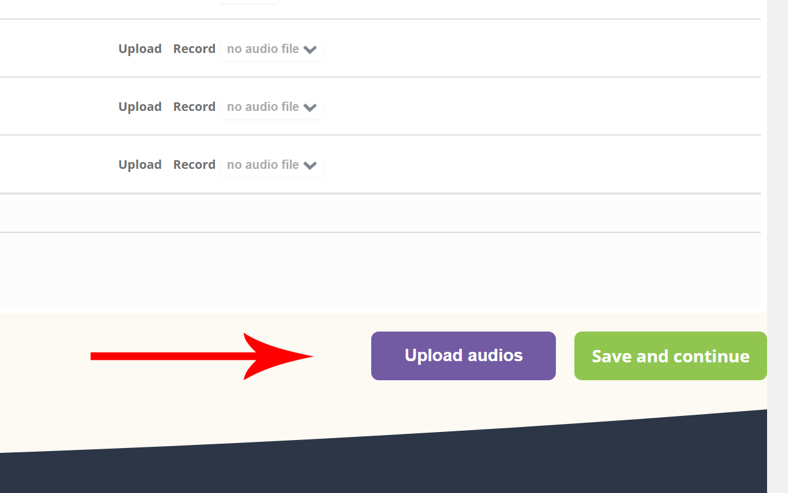
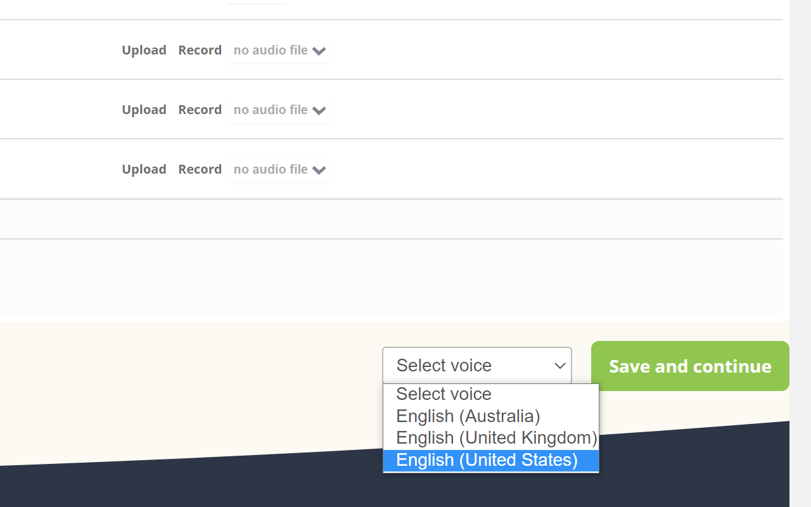
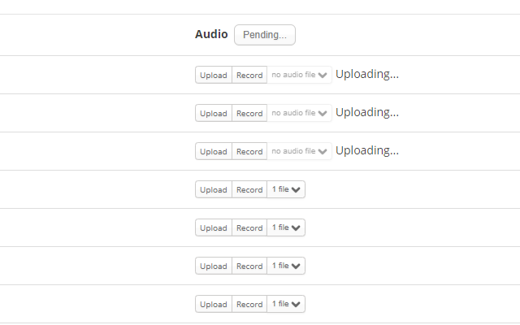

# Memrise Audio Uploader
Chrome extension which allows you to upload sounds of words and phrases pronunciation from http://soundoftext.com to http://memrise.com course

## Install from the stores
[Chrome Web Store](https://chrome.google.com/webstore/detail/memrise-audio-uploader/fonhjbpoimjmgfgbboichngpjlmilbmk)

[Firefox Add-ons](https://addons.mozilla.org/firefox/addon/memrise-audio-uploader/)

To download the offline versions please go to the 
[Releases page](https://github.com/cardinalby/memrise-audio-uploader/releases).

## Screenshots

